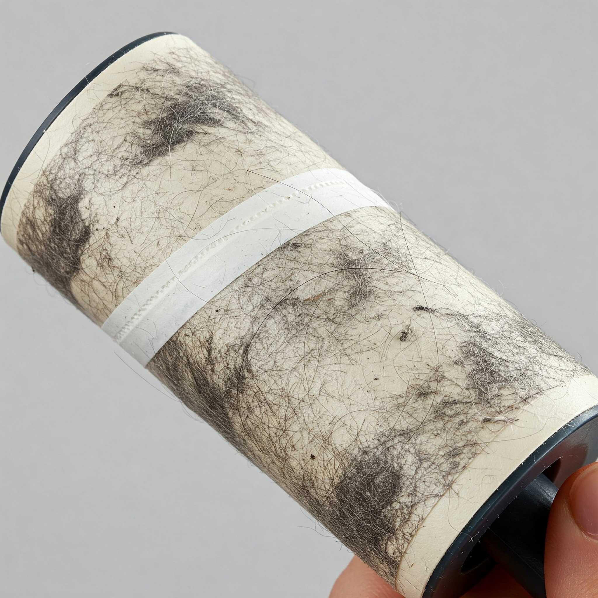

  

## ESLint-Roller...?

For 2025’s spring cleaning, I wanted to Marie-Kondo my life and was hoping ESLint could help. I initially thought of ESLint as an actual lint-roller, magically gliding away all my  

code's fuzzy and unsightly problems. I did not expect it to add to the issues in a nightmarish fashion, if only to improve the styling of my code to its standards. 

## Snowball of Anxiety

  

Although the standards themselves were mostly sensible, such as dictating where to use or remove whitespace or suggestion to change a variable from let to const (I am  

guilty of encountering this the most), the fact that there is instantly a squiggle under a styling issue even before running npm lint or the --fix in the terminal contributes to the  

amassing snowball of overwhelm and stress from previewing the amount of 'errors'  there may be in the code. The snowball in question aggregates at an even more alarming  

pace when using ESLint during a timed event (like the WODs in class or to practice), because it causes the Problems tab to display more to fix than without the tool. 

## Warp My Code, Why Don't You

While many of the formatting conflicts can be resolved by 'de-fuzzing', or deploying npm run lint and --fix, it will change some of the code to a state of no longer functioning as  

intended. Some example of this were forcing my let’s into const’s, demanding that I use some other type than any for returns or variable/parameter types, or removing entire  

blocks of code instead of only the lines with if() {  just because it preferred there to not be an "unnecessary" if-statement. Reinventing a small wheel by rewriting a block of an  

if-statement isn’t exactly joyful, especially if there were more than a few lines within the block. It wouldn’t necessarily be the easiest to remember every precise line we wrote  

the first time, so the revised statement may have fundamental changes. 

## Inconvenience-Turned-Recommendation

  

The problem with the appearance of an optional set of problems or errors makes it difficult to differentiate at first glance which ones are the priority for debugging, which is  

not exactly helpful when working within a time limit. It would be appreciated if these violations of the standard would only appear after running the lint command, rather than  

before I’ve asked or been interested to know where the problems are. Error lines are also quite distracting (though what isn’t a detriment to our attention spans in this day  

and age), and if the lines specific to ESLint only were visible after running the command (or not at all) it would be more 
time-efficient to identify which problems would actually  

break the code instead of being solely cosmetic. 

## Final Thoughts

I never considered using a standard to help me learn a programming language. It may help other people, but to my understanding (at least the one about how I operate in  

general), the standards can be applied to help reinforce existing knowledge of the language. However, this isn’t to say that the standard is without its benefits in terms of  

learning more bits of information about the language. I did notice some differences between Javascript and Typescript from using ESLint, most notably being reminded that  

Javascript does not need or use explicit variable type declarations but rather 'just goes with the flow' of things. Overall, no, ESLint and the class’s coding standards did not spark joy  

and will not make the list of household essential tools for my seasonal, post-new year cleanout. 

  

Used AI to make silly pictures..? but not write this reflection.
