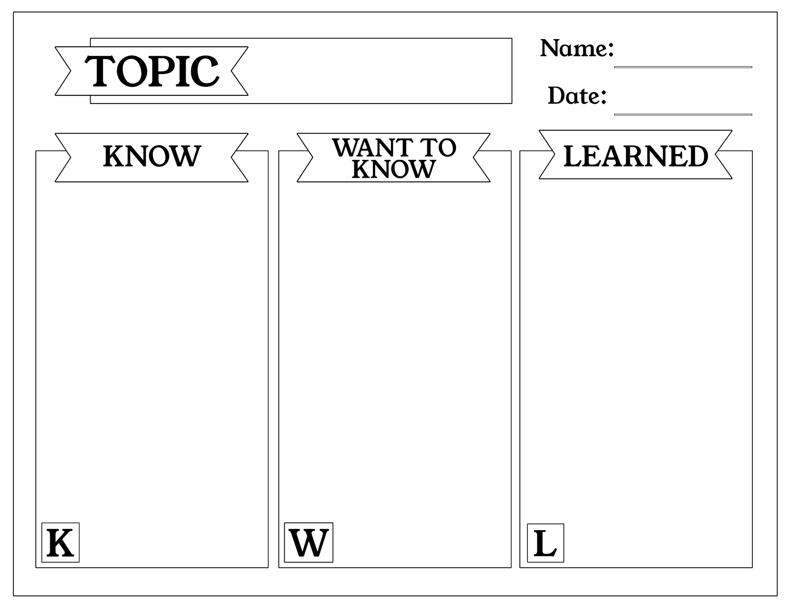

Many different concepts and skill topics were introduced and prescribed in this third-year software engineering course, but some of the most appealing and withstanding values and ideas that I feel will continue to be relevant and applicable beyond the semester are those of coding standard, development environments, and ethics as a part of software engineering. Let’s discuss what these mean and how I plan to keep using them in the future.

  

### Known: Development Environments

Before taking ICS 314, I already had knowledge and experience in multiple different development environments. <a href="https://www.indeed.com/career-advice/career-development/development-environment">An Indeed article on DEs</a> regards them as "a collection of procedures and tools designed to develop, test and debug an application, program or website". I have been using VSCode since high school STEM courses, and then first and second-year professors led classmates and me to use JGrasp and Eclipse for Java. Then, at a less sophisticated level and non-IDE, I learned how to use the command line on Mac and Linux– specifically for the C language series. Finally, 314 has slung Intellij Idea into our paths as a suggestion and required proficiency in Typescript Playground to add to our toolbelts. 

While Typescript would have a primary use in web development, the rest of the DEs above can definitely be involved in creating many other types of programs. For example, a Java-focused DE can be used to create a simple game, as completed in ICS 111. The command line, while not impossible, can be an unnecessary struggle if trying to utilize for webpages. It would have a better purpose writing C programs in Vi or Emacs, possibly to establish communications with a particular server by sending it a request.  Nearly all users are aware that VSCode can be used for so many different purposes that its functionality is nearly limitless. One can write Python code in VSCode, which is largely used for data processing and analytics. As a bonus tip, Jupyter products can also be  used to make 'notebooks' of Python blocks, which are great to test by a section at a time and do on-the-spot debugging.

### Wanted to Know: Coding Standards

Coding standards, which are a set of rules regarding the stylization of code, can be flexible and unique to every group or situation imposing these rules upon the programmer. Because they can be applied to any project context, standards exist well beyond simple web application development. ICS 314 heavily encouraged the use of ESLint extension in VSCode, which typically is meant to clean up Javascript or Typescript code according to a specific standard. This is one type of enforcement of standards that, because we know that JS/JSX and TS/TSX are specifically most applicable in web design, does not have as much function outside of that primary purpose. However, naming conventions and comments are more coding standards that occur in any language for any project type. These are intended for clear communication between developers when sharing code, and offer the benefit of minimizing confusion in reading unfamiliar programs. Comments have already been especially helpful in a group project for the required algorithms course, as my team and I were contributing to a sorting program made with Python by sharing our file portions and commits to the Github repository.

### Learned: Ethics in Software Engineering

In one of the last working days of the semester, we began to explore the importance of ethics in our field beyond the classroom.  We did this by holding a debate with the prompt "Several violations of the standard code of ethics regarding consumer privacy were discovered within your company’s facial recognition product, is it ethical to continue working at this company on this project?".  The full list of programming ethics’ standards can be found at [https://www.acm.org/code-of-ethics](https://www.acm.org/code-of-ethics) , and it defines itself as the "conscience of the profession", with "statements of responsibility, based on the understanding that the public good is always the primary consideration". Evidently, this scenario spans beyond web app development, as facial recognition is implemented in concurrence with camera hardware, and products may not necessarily have a customer-accessible web interface/ it is not assumed. It is also implied that to have reached this progress point and level of responsibility, one must have proven to be able to do and have more experience than simply creating websites. The engineer in question would have needed to surpass the mere requirement of third-level software engineering course, as well as obviously proceed on to graduate and find a career path that would allow them to ascend far enough in their company to be part of a project of this caliber.

Assuming that I can eventually land a developer job, of course I plan to consult the ethics standards if or when I am involved in a project to the scale where enough context is given to determine if what I and the rest of the team are doing is fully ethical. The valid argument outcome points from both designated sides of the debate made myself and the rest of the class aware how ethics can have a pivotal role in the directions we take with our software designs and involvement in a project’s cause.

### Takeaways 

Of the multitude of subjects covered in ICS 314, I found awareness of development environments, coding standards, and ethics from a software engineering perspective to be the most relevant in my future career. I was already familiar with many development environments, and taking this course helped me learn how to maximize the efficiency of my VSCode usage, as well as open my mind to the possibility of using Intellij Idea. I had a willingness to delve into coding standards, even at the expense of struggling to keep in stride with all of ESLint’s demands and expectations. Lastly, we opened the conversation surrounding ethics in software development by examining a hypothetical case study of whether it would be morally sound to continue working at a firm after realizing how many ethical violations were involved in distribution of a facial recognition program. This examination of relevance in these software engineering topics effectively demonstrated the flow of a KWL chart, ordered by procedural learning steps and traditionally used in k-12 classrooms for subjects such as history, business, and economics.

Did not use AI to write this essay.

