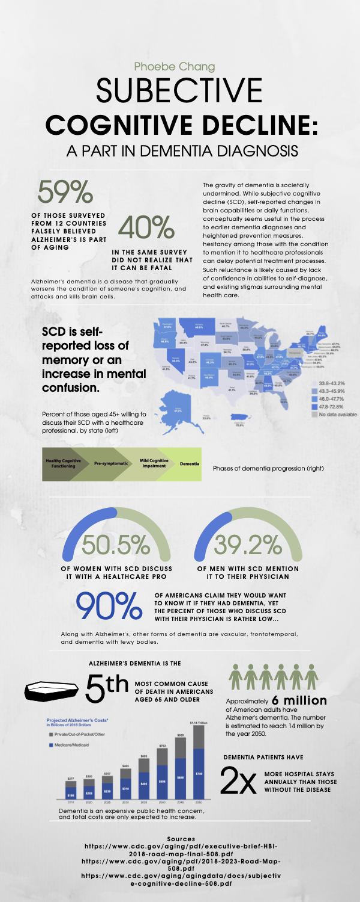

Vacay is a web application that I helped create as a team project in ICS 415, Spring 2015. The project helped me learn how to design and implement a responsive web site.

 
Source: <a href="https://github.com/theVacay/vacay">theVacay/vacay</a>
