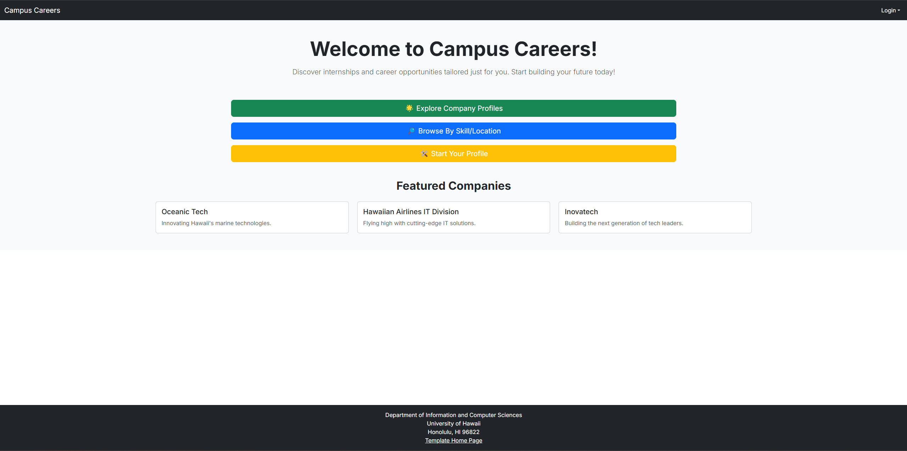

  

## Overview

We built this site to help students and companies find each other through its portal, with companies selecting their ideal candidates based on ideal skills and students searching for companies by filtering to match their interests based on those in their student profiles.

## Phoebe’s Role

Some of my contributions to building the program were initial versions of the admin login pages; including the student and company lists, new student and company forms, and early models and objects in the Prisma Schema database file. I also surveyed community members to garner their feedback after testing our project.   

## Know-WantToKnow-Learned

* We all began with our existing knowledge and experience from the athletic programming activities from the software engineering course, which included use of PostgreSQL, React Typescript, and finessing the outcome of starting from a NextJS template.
* I came into this project wanting to know about the process of building a web application, as well as the time it would require to complete the entire thing.
* The group and I collectively learned just how time consuming and stressful development deadlines could be, as well as navigating areas where taking advice from AI would be somewhat applicable and even useful at times.

### <a href="https://github.com/campus-careers">Team Github</a>
Click the link to see our project milestones, documentation, and source code repositories
